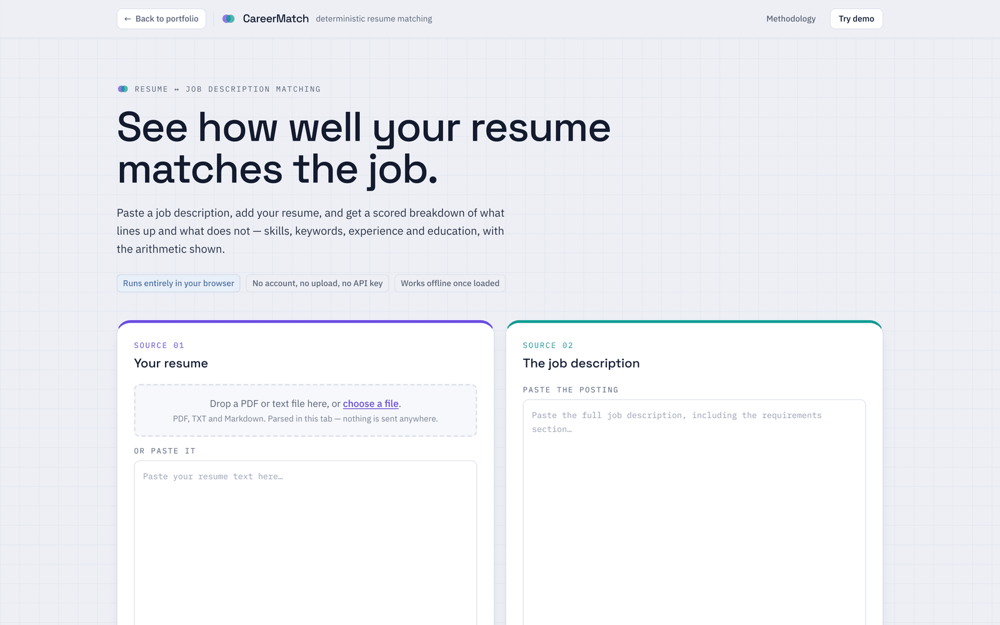
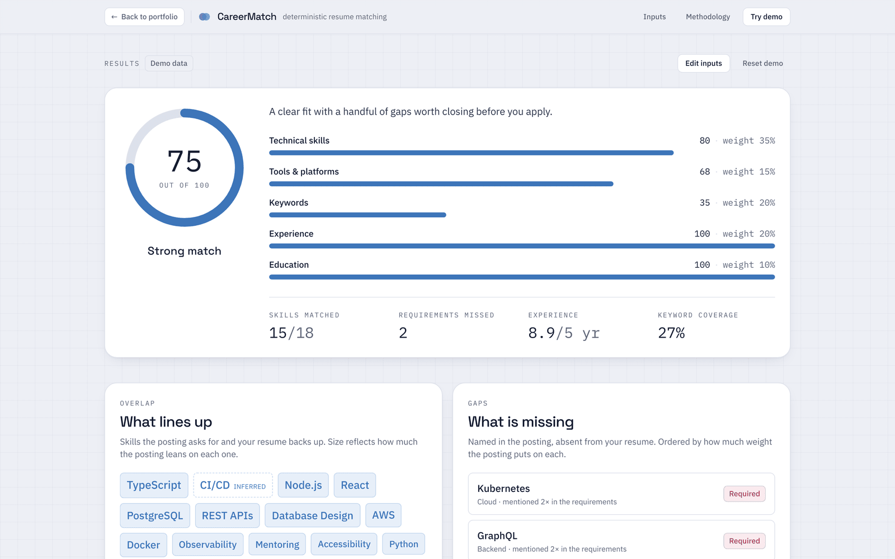
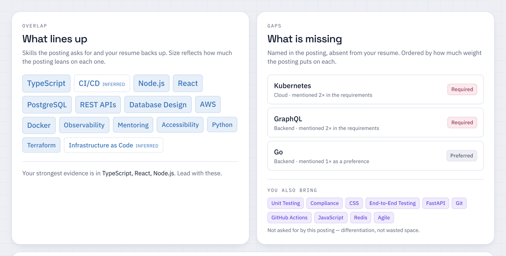
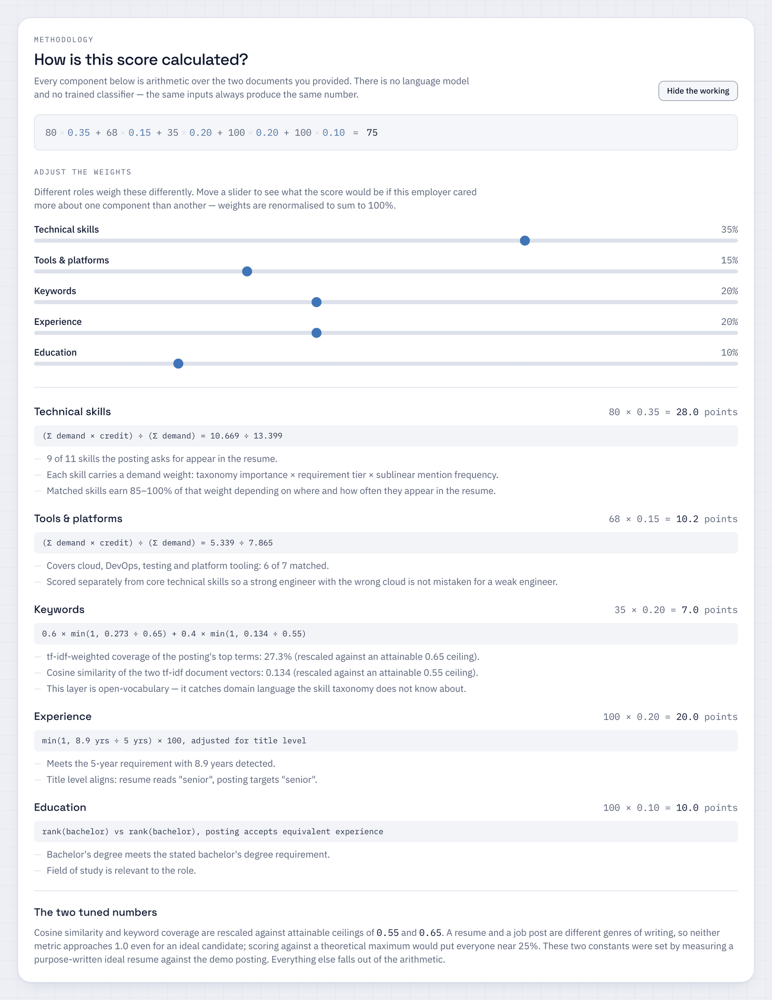
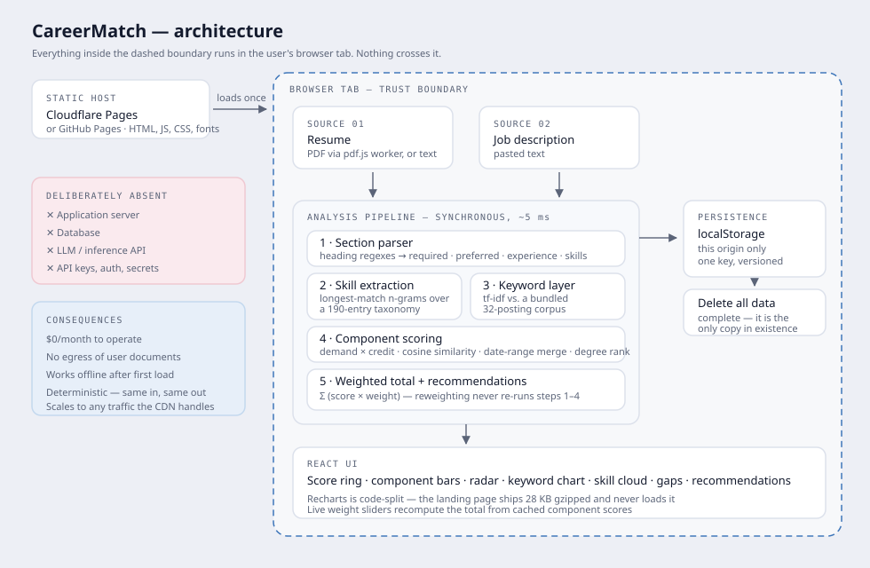

<div align="center">


# CareerMatch

**See how well your resume matches the job.**

A resume ↔ job-description matching engine that runs entirely in your browser.
No backend, no database, no API keys, no language model — and nothing you upload ever leaves the tab.

[**Try it live →**](https://darel-rodriguez.com/careermatch/)


</div>

---

Paste a job description, add your resume, and get a scored breakdown of what lines up and what
doesn't — skills, keywords, experience and education, **with the arithmetic shown on screen**.

Click **Try demo** on the landing page and the whole thing runs in about four seconds on a realistic
example.

## Why this exists

Most resume scanners hand you a number and no reasoning. This one does the opposite: the scoring
formula is rendered live in the UI, every component shows its working, and you can **drag the
weights and watch the total recompute**. Same inputs, same number, every time.

The name says "AI"; the footer of the running app says otherwise, in plain text. There is no model
here — it's classical information retrieval (TF-IDF, cosine similarity, weighted set coverage, a
curated taxonomy). That's deliberate. You cannot build an inspectable score on top of a black box,
and someone told their resume scored 62 deserves to see why.

## Screenshots

> Replace these with your own captures — `docs/` is already in place for them.
> Run `npm run dev`, click **Try demo**, and everything below is on screen in four seconds.

| | |
|---|---|
|  |  |
| **Landing** — resume left (violet), job description right (teal) | **Results** — score ring and the five weighted components |
|  |  |
| **Overlap & gaps** — matched skills sized by demand | **Methodology** — the live formula and weight sliders |

## Quick start

```bash
git clone https://github.com/Darel1997/careermatch.git
cd careermatch
npm install

npm run dev            # http://localhost:5173
npm test               # 181 unit + component tests
npm run build          # static bundle in dist/
```

End-to-end tests need browser binaries, which `npm install` doesn't fetch:

```bash
npm run e2e:install    # ~150 MB, one time
npm run e2e            # 19 specs x Chromium + Pixel 7 = 38 runs
```

## How it works

```
parse sections
  -> extract skills      (closed vocabulary: 190-entry taxonomy, longest-match n-grams)
  -> extract keywords    (open vocabulary: tf-idf against a bundled 32-posting corpus)
  -> vectorise both documents
  -> score five components
  -> weight and combine
  -> derive recommendations
```

The whole pipeline is synchronous and runs in roughly **5 ms** on a laptop, under 20 ms on a phone.

### The score

```
overall = 0.35·technical + 0.20·keywords + 0.20·experience + 0.15·tools + 0.10·education
```

Weights are adjustable in the UI and renormalised to sum to 1.

<details>
<summary><b>Technical skills &amp; tools — <code>Σ(demand × credit) ÷ Σ(demand)</code></b></summary>

<br>

```
demand   = taxonomy weight × requirement tier × sublinear frequency
credit   = 0.85 + 0.15 × evidence     (matched, stated)
         = 0.70                        (matched, inferred)
         = 0                           (missing)
evidence = 0.6 × section placement + 0.4 × mention depth
```

**Requirement tier** comes from section parsing — a skill under *Requirements* counts 1.0, under
*Responsibilities* 0.85, under *Nice to have* 0.5. A skill named twice in the requirements outranks
one named once as a preference, which is how a human reads the posting.

**Sublinear frequency** is `1 + log₁₀(count)`. A posting that says "React" nine times isn't nine
times more about React than one that says it once.

**Evidence** separates a skill demonstrated inside an experience bullet from one dumped in a keyword
list. It can only ever raise credit from 0.85 to 1.0 — a bonus for depth, never a penalty for being
concise.

**Inference.** Someone who ships GitHub Actions pipelines does CI/CD whether or not they wrote the
letters; PostgreSQL implies SQL. Inferred matches earn 0.70 and are labelled in the UI with their
source. Three constraints: **candidate-side only** (a posting asking for Kubernetes is asking for
Kubernetes — inflating demand would invent requirements), **discounted**, and **one hop only**
(Next.js implies React, but not JavaScript — transitive closure over a hand-written graph drifts
fast).

Technical and tools are scored separately so a strong engineer with the wrong cloud isn't mistaken
for a weak engineer.

</details>

<details>
<summary><b>Keywords — <code>0.6 × coverage + 0.4 × cosine</code>, both rescaled</b></summary>

<br>

The taxonomy can only find what it already knows. The keyword layer is the open-vocabulary
counterpart: it ranks whatever the posting actually emphasises — "logistics", "multi-tenant",
"regulated" — and checks the resume for it. Precision from the closed set, recall from the open one.

**IDF comes from a bundled corpus of 32 postings, not from your two documents.** With a corpus of
size two, every shared term gets an identical weight and cosine similarity degenerates into raw
overlap. The corpus is ~9 KB compiled into the bundle, so it costs no request and works offline.

Only substantive sections feed this layer — company blurbs, benefits lists and the letterhead are
excluded, because "snacks" and "equal opportunity employer" aren't things a resume should be
penalised for omitting.

</details>

<details>
<summary><b>Experience &amp; education — parsed, not guessed</b></summary>

<br>

**Experience** takes two independent readings: date ranges in four formats (`Mar 2021 – Present`,
`03/2019 - 06/2021`, bare years, full month names), **merged as intervals** so overlapping roles
count once — a contractor with three concurrent clients hasn't worked nine years in three. A
self-reported "8 years of experience" is used only as a fallback.

**Education** ranks degrees rather than string-matching them, so a Master's satisfies a posting
asking for a Bachelor's, and "or equivalent experience" is detected and honoured.

Both refuse to fail silently. No stated requirement scores a neutral 82/85 rather than zero. An
unparseable resume scores 55 **and says exactly why** — quietly scoring someone as inexperienced
because their date format didn't parse is the worst habit of automated screening, and this doesn't
replicate it.

</details>

<details>
<summary><b>The two tuned numbers</b></summary>

<br>

`COSINE_CEILING = 0.55` and `COVERAGE_CEILING = 0.65` are the only hand-set constants in the engine.
A resume and a job post are different genres of writing, so neither metric approaches 1.0 even for an
ideal candidate. They were set by measuring a purpose-written ideal resume against the demo posting:

| Resume | coverage | cosine | keyword score | **overall** |
| --- | --- | --- | --- | --- |
| Purpose-written ideal | 0.67 | 0.54 | 99 | **97** |
| Demo (realistic, imperfect) | 0.27 | 0.13 | 35 | **75** |
| Pastry chef | 0.00 | 0.00 | 0 | **27** |

Scoring against a theoretical 1.0 would put every candidate on earth near 25%. Everything else in
the engine falls out of the arithmetic.

</details>

## Architecture



```
src/
├── lib/                    # the engine — zero React, zero DOM, pure functions
│   ├── taxonomy.ts         # 190 skills · aliases · weights · implication rules
│   ├── corpus.ts           # 32 bundled postings, used only to compute IDF
│   ├── text.ts             # tokeniser, stemmer, stopwords
│   ├── sections.ts         # heading detection
│   ├── skills.ts           # longest-match n-gram extraction
│   ├── keywords.ts         # open-vocabulary tf-idf layer
│   ├── tfidf.ts            # vectoriser + cosine similarity
│   ├── experience.ts       # date-range parsing and merging
│   ├── education.ts        # degree ranking
│   ├── scoring.ts          # demand, evidence, credit, weighting
│   ├── recommendations.ts  # condition-triggered advice
│   ├── analyze.ts          # the pipeline
│   ├── extract.ts          # pdf.js text extraction
│   └── storage.ts          # localStorage with a complete delete
├── components/             # React UI
└── test/
e2e/                        # Playwright specs
```

The engine is deliberately isolated from React — every file in `src/lib` is a pure function of its
arguments, which is why the tests cover the interesting behaviour without rendering anything.

## Privacy

> **Your resume never leaves your browser.**

A structural claim, not a policy promise:

- The site is a static bundle. **There is no server endpoint to receive a document.**
- PDF parsing runs in a same-origin web worker via pdf.js; the file is read with `FileReader`.
- Persistence is a single versioned `localStorage` key.
- **Delete all stored data** is a complete delete — it's the only copy that ever existed.
- A Playwright spec asserts **zero non-GET requests** during a full analysis.

Open DevTools → Network, run the demo, watch nothing happen. That's the whole argument.

## Why no backend

| A server would give us | We get it another way |
| --- | --- |
| Heavy computation | The pipeline is ~5 ms. There's nothing to offload. |
| Model inference | There is no model. |
| Persistence | `localStorage` — the data belongs on the user's device anyway. |
| Secrets management | No secrets, because no third-party APIs. |
| Scale | A CDN scales further than anything I'd run. |

What a backend *would* add: hosting cost, an egress path for the most sensitive document most people
own, a privacy policy, a breach surface, and an ops burden.

**Operating cost: $0/month**, permanently, on any static host's free tier.

## Testing

```bash
npm test               # 181 tests
npm run test:coverage  # v8 coverage over src/lib
npm run e2e            # 38 runs across two viewports
```

**Unit tests (170)** cover the cases that actually break resume parsers:

- `C++`, `C#`, `.NET`, `node.js`, `CI/CD` survive tokenisation as single tokens
- `services` → `service`, but `access`, `analysis` and `status` are left alone
- Longest match wins — "React Native" never also fires "React"; `k8s` and `Kubernetes` resolve to one skill
- Ambiguous words are context-gated: *"please go to the office"* isn't Golang, *"backend services in Go"* is
- Cosine identity, orthogonality, symmetry, length invariance, empty-vector safety, float drift
- Overlapping date ranges merged; reversed and implausible ranges rejected
- Pipeline is deterministic, asymmetric, and never returns a score outside 0–100

**Component tests (11)** render the real app in jsdom and drive the demo flow, weight adjustment,
reset and data deletion.

**End-to-end (19 specs)** run against the production build: demo mode, file upload, manual analysis,
persistence across reload, keyboard navigation, screen-reader labels, a 375 px viewport, and
**continued operation with the network switched off**.

## Deployment

Any static host — output is `dist/`.

**Cloudflare Pages:** build `npm run build`, output `dist`, Node 20+.

**Subdirectory deploys** (GitHub Pages, or nested under a portfolio):

```bash
BASE_PATH=/careermatch/ npm run build
```

No environment variables, no secrets, no runtime.

## Technical decisions

- **A curated taxonomy alongside statistics.** Pure tf-idf can't know `k8s` and `Kubernetes` are the
  same thing. Two documents contain nowhere near enough signal to learn that.
- **Sections are parsed first.** Where a skill appears changes what it means; almost every
  interesting scorer behaviour depends on it.
- **Longest-match-first with token consumption** — what stops "React Native" from also firing "React".
- **A conservative stemmer, not Porter.** Stems are shown to the user, so `kubernetes` → `kubernet`
  would be visible noise.
- **IDF is frozen at module load.** Analysing a second posting can't silently change the first score.
- **Rescoring is separate from analysis.** `rescore()` recomputes only the weighted sum, so slider
  drags are free and provably can't change the extraction — there's a test asserting it returns the
  *identical* `skills` array reference.
- **Recharts is code-split**; pdf.js is dynamically imported. The landing page ships **28 KB gzipped**
  and someone who only pastes text never downloads the 102 KB PDF parser.
- **Fonts are self-hosted.** A Google Fonts link would be a third-party request and would break the
  offline claim.
- **Colour is a system.** The resume is violet, the job description is teal, and anything they share
  is drawn in the optical blend of the two.

## Limitations

Stated plainly, because a scoring tool that hides its failure modes is worse than no tool.

- **Not an ATS.** Real applicant tracking systems are proprietary and differ from each other. This
  models the *idea* of keyword screening, not any vendor's implementation.
- **English only** — stopwords, stemmer and taxonomy.
- **Scanned PDFs fail.** No OCR; a PDF with no text layer gives a clear error rather than a silent
  empty analysis.
- **No `.docx`** — parsing it would add a dependency heavier than the rest of the app.
- **The taxonomy is finite.** ~190 skills covers mainstream software, data, cloud and security well
  and drops off outside them.
- **Section detection needs conventional headings.** Without them the resume degrades to one block
  and evidence weighting is lost — the results page shows the parsed sections so this is visible.
- **Two-column PDFs can interleave**, since text is reconstructed from glyph baselines.
- **The ceilings are calibrated against one document pair.** A labelled sample would set them better.
- **Scores are directional, not authoritative.** Nothing here can tell you whether you'd be good at
  the job.

## Future improvements

- Ship a compact embedding model (MiniLM via `transformers.js`) in a worker to catch paraphrase —
  "led a team of six" vs "people management" — as an *additional* component, keeping the
  deterministic layers as both fallback and explanation.
- Rank multiple postings against one resume.
- Diff view: re-analyse after editing and show which recommendations moved the score.
- Client-side PDF export of the report.
- Larger IDF corpus generated at build time.
- Calibration study against real screening outcomes to replace the two hand-set ceilings.

## License

Copyright © 2026 Darel Rodriguez. All rights reserved.

This project is published for portfolio and evaluation purposes. You're welcome to read the source and run it locally to assess my work. Copying, modifying, redistributing, deploying or using it commercially requires my written permission — see LICENSE for the full terms.

For licensing enquiries: darelrodriguez1997@gmail.com
